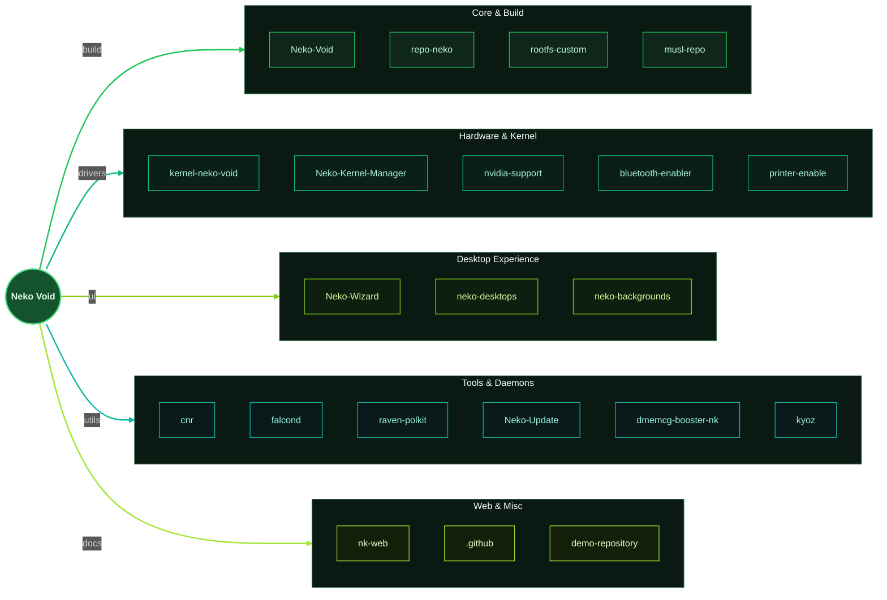

# Neko Void Linux (=^･ω･^=)

Welcome to the official Neko Void development organization. We are the team behind the Venezuelan-origin distribution designed to bring the power, lightness, and independence of Void Linux to any user without technical complications. \o/

## About Us (^._.^)ﾉ

Our main focus is to offer the speed of a minimal base system along with a ready-to-use desktop experience. We facilitate the use of a systemd-free environment through graphical installers and native post-installation tools. The system is optimized for various daily workflows, covering (a) gaming [+..••], (b) design, (c) music production ♪, (d) video editing [|>], and (e) office tasks.

## Ecosystem Features (b^_^)b

We work to deliver a highly functional operating system right out of the box. Neko Void includes full Vulkan support with pre-configured Intel and AMD drivers, native PipeWire integration for multimedia workloads, and ready-to-use tools like iruka-xbps, Neko-Kernel-Manager, Vouru, Falcond, and btop. We support architectures with both UEFI and Legacy BIOS systems to ensure maximum hardware compatibility.

## Projects and Collaboration ヽ(´▽`)/

Within this organization, we manage the development environment and foster open-source collaboration. We develop and maintain the core of the distribution, associated launcher tools, and software repositories. We seek to eliminate entry barriers while maintaining the efficiency that characterizes the base system.

## Official Links (ﾉ^ヮ^)ﾉ*:･ﾟ✧

You can find more information, documentation, and access our downloads by visiting our official website at nekovoid.vercel.app or by exploring the pinned repositories on this page. (=^ ◡ ^=)

# KYOUKO LOVE's VOIDLINUX

## Repository Map UwU

